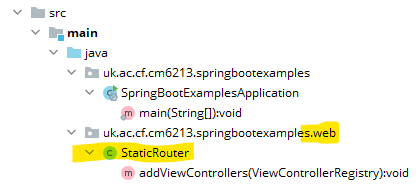

summary: Adding More Static Content to a Spring Boot Application
id: adding-more-static-content-Spring-Boot
categories: Sample
tags: medium
status: Published
authors: Carl Jones
Feedback Link:

# Adding More Static Content to a Spring Boot Application
<!-- ------------------------ -->
## Overview
Duration: 5

### What You'll Learn
- Adding another static files
- Observing the routing behaviour of Spring Boot
- Adding a route

<!-- ------------------------ -->
## Adding static content

In IntelliJ, build on the previous project where we added an ```index.html``` file.

Add a file called "about-us.html" to the static folder.  You can put any HTML in here that you like.

* Use the reload trick that you learned to add this content.

## Test the Content

Go to http://localhost:8080 in a browser of your choice.

Go to http://localhost:8080/about-us in a browser of your choice.

Negative
: This won't work!

Go to http://localhost:8080/about-us.html in a browser of your choice.

Positive
: This will work.

* What's happening here?


## Spring Boot's routing

Spring Boot has a set of conventions.  It was happy to map the index route,
but it treats all other HTML files in static as ".html" routes.

We can get around this.

## Add a router class

We're now going to add our first application code to Spring Boot.

Create a new package in your Java code.  Make it a sub-package of the package
created when you generated the application.

For example, in this example, we've added the "web" package.



In that package, add a class called "StaticRouter" and add this code to it (amending the package to suit your own).

```Java
package uk.ac.cf.cm6213.springbootexamples.web;

import org.springframework.context.annotation.Configuration;
import org.springframework.web.servlet.config.annotation.ViewControllerRegistry;
import org.springframework.web.servlet.config.annotation.WebMvcConfigurer;

@Configuration
public class StaticRouter implements WebMvcConfigurer {

  @Override
  public void addViewControllers(ViewControllerRegistry registry) {
    registry.addViewController("/about-us").setViewName("forward:/about-us.html");
  }

}
```

## Observe the code

We can see a few things in this code.
1. It uses an annotation ```@Configuration```.  This tells Spring Boot that
this is a configuration component.  The annotation tells Spring when to run
the code.
1. The class implements an interface provided by Spring.  This is another
way in which frameworks can provide reusable code.  Essentially, they are saying
that if the application developer provides an implementation of this interface, they
will call it.
1. The interface requires one method to be implemented, and in this method, we map
the route "about-us" to the HTML page "about-us.html".

Positive
: We will also use the term "bean" when referring to Spring components so this is also known as a "Spring Bean".

## Refresh and Test

* Run the gradle > build > classes task.
* Test "about-us.html"
* Test "about-us" - does it work now?

## Review

In this tutorial, we've added static content and learnt a bit about Spring's
routing rules.
