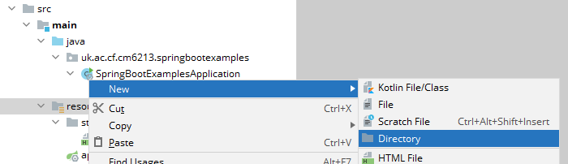

summary: Adding Static Content to a Spring Boot Application
id: adding-static-content-Spring-Boot
categories: Sample
tags: medium
status: Published
authors: Carl Jones
Feedback Link:

# Adding Static Content to a Spring Boot Application
<!-- ------------------------ -->
## Overview
Duration: 5

### What You'll Learn
- Adding a static HTML file to a Spring Boot server
- Testing the server
- Making changes quickly

<!-- ------------------------ -->
## Adding static content

In IntelliJ, create a new project as per the "Starting Spring Boot" tutorial.

Positive
: RECALL: Spring Boot follows the convention-over-configuration pattern.  The static files can be found in ```/src/main/resources/static```.

You will need to create the ```static``` folder.



Right-click on the resources folder and create a new directory.  Call it "static".

Now, right-click on the new folder and create a new HTML file.  Call it "index.html" and add some content.

```html
<!DOCTYPE html>
<html lang="en">
<head>
    <meta charset="UTF-8">
    <title>Hello World</title>
</head>
<body>
<div>
    Hello World!

    <H1>Things to note:</H1>
    <ul>
        <li>The generated code gave us a working application capable of handling requests.</li>
        <li>To get a real page, add a HTML file to ~/main/resources/static.</li>
        <li>With DevTools installed, you don't need to restart the server, but you do need to re-build the code. Use
            gradle assemble.
        </li>
        <li>You can use Live Reload in your browser to trigger a page reload on change.</li>
    </ul>
</div>
</body>
</html>
```

## Install a Live Reload Plug-in

Positive
: Install a Live Reload plug-in/extension for your browser of choice.
: There are many available.


## Run the project

Run the Spring Boot application using the bootrun method.

## View the content

Go to http://localhost:8080 in a browser of your choice.

You will see the page.  Spring Boot routes to the index.html page as you would expect.

## Change and reload the content

Leave the server running.

Make a change to the HTML page.

Execute gradle > build > classes.

The change should appear in the browser automatically.  This is Live Reload
in action.  If you examine the server log, you will see that a Live Reload
server is started for you.  This is because we included DevTools in the
project.

Negative
: What could be the problem with this?
