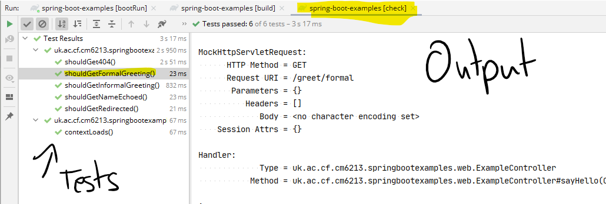

summary: Automating MVC Tests
id: automating-mvc-tests
categories: Sample
tags: medium
status: Published
authors: Carl Jones
Feedback Link:

# Automated Tests of Spring MVC
<!-- ------------------------ -->
## Overview
Duration: 10

### What You'll Learn
- How to write automated tests that invoke web requests and check responses
- How Spring supports testing

<!-- ------------------------ -->

## Understand the goal

We want to send a series of requests to the application and check the responses.
We want to check both the HTTP status code and the response body.

## Add test code

Remember the folders that were generated by Spring?

It generated a parallel set of test folders.  We will add a package and a class to
/src/test/java.

## Create a package

In the sample code, we've created a sub-package called "mvc" to distinguish the types of test.
There are many views on whether the test packages should match the application packages.  
The consensus is that they shouldn't and the tests should actually focus on what needs to be
tested rather than mirroring how the code is structured.  This makes sense as we will want
to change the structure of the application main code, but leave the tests untouched.

## Create the test class

There are a number of steps to making a test.

## Add an annotated class

```Java
@AutoConfigureMockMvc
@ContextConfiguration(classes = {ExampleController.class})
@WebMvcTest
public class GreetingsTests {
```

What do these annotations do?

* AutoConfigureMockMvc - tells Spring to create a mock MVC container.  This avoids having to start a full server which means the tests run faster.  It also means that certain parts of the container are not loaded thus limiting the tests that can be run.
* ContextConfiguration - tells Spring which beans (components) to load as part of the container. Typically, which components are being tested.  Here we are testing the ExampleController.
* WebMvcTest - tells Spring to configure MVC-related components only.  We'll understand this more later when we add other types of components.  By limiting the types of components that get loaded, we will get faster setup time so the total time for testing will go down.  We don't want to find excuses not to write and run tests so Spring helps by offering options to speed up their execution.

## Inject the mock container

In order to run the tests, we need the controller beans to be loaded into a suitable container (so that Spring can route the requests to the controller).

```Java
@Autowired
private MockMvc mockMvc;
```

The @Autowired annotation asks Spring to provide the test with a MockMvc component.  This is an example of dependency injection.
In order to run tests, the test code is dependent on the a MockMvc component.  The test class doesn't create an instance of the class, rather it asks
Spring to inject one.  This is a core part of Spring (indeed of most frameworks).  Search for the SOLID design principles online.  You will find that the D in SOLID is for Dependency Injection.

## Write the tests

```java
@Test
 public void shouldGetInformalGreeting() throws Exception {

   this.mockMvc
           .perform(get("/greet/informal"))
           .andDo(print())
           .andExpect(status().isOk())
           .andExpect(content().string(containsString("CM6713")))
           .andExpect(content().string(containsString("Hi...")));
 }
```
The method is annotated with a standard @Test annotation.  This tells the test
framework that this is a test.

### Perform the request.

```java
   this.mockMvc
           .perform(get("/greet/informal"))
```

This makes the web request to the mock MVC container.  We would expect this to be routed to
our controller.

### Output to the console

```Java           
.andDo(print())
```
This tells Spring to output the results of the test.

### Check the HTTP status

```java           
.andExpect(status().isOk())
```

We expect this request to work, so we expect a 200 (OK) response.
At this point, you need to remind yourselves of the REST principles that
you touched on in earlier modules.  REST uses the HTTP status code and HTTP verbs
as first class players in the design of RESTful APIs.

### Check the content

Here we expect to receive the defaults.

```Java
.andExpect(content().string(containsString("CM6713")))
.andExpect(content().string(containsString("Hi...")));
```

Finally we need to check the content.  With this request, we expect the content to contain
the strings provided.  Typically, we would check more than this.
Where we're generating HTML, we would look certain HTML fragments.
If we were testing a RESTful API, we would look for JSON fragments.

Spring provides convenience methods for targetting certain fragments of both.

## Other Tests

The sample code provides other tests as examples including a test for a missing resource and for redirections.

## Run the code

To run the full, we need to run Tasks > build > build from the Intellij Gradle window.

We won't see the full test results in the run window.

To do that, run the Tasks > verification > check task.

You can click on each test to see the output (from ```java andDo(print())```).



## Review

In this tutorial, we've introduced automated tests.  One of the leaps that Spring brought over
previous frameworks was its support for testing and in particular the ability to run tests quickly and
with reduced server start-up time.

Research Spring's [other testing facilities](https://spring.io/guides/gs/testing-web/) and [references](https://docs.spring.io/spring-boot/docs/2.3.4.RELEASE/reference/html/spring-boot-features.html#boot-features-testing).
