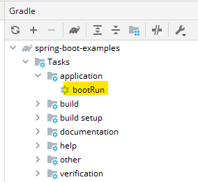
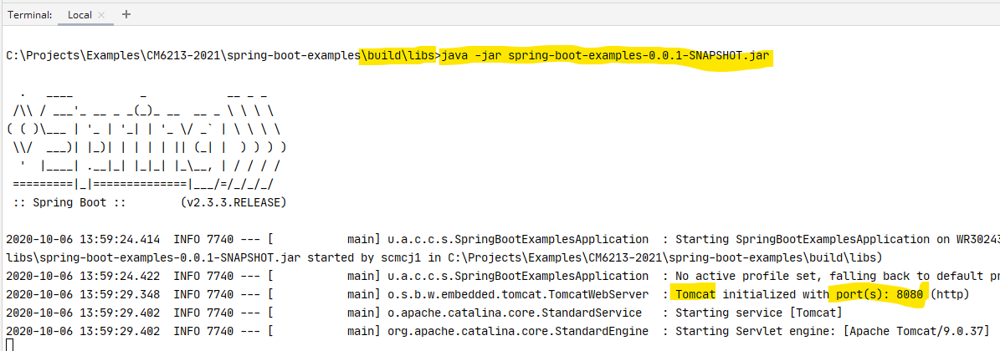

summary: Running Spring Boot
id: running-Spring-Boot
categories: Sample
tags: medium
status: Published
authors: Carl Jones
Feedback Link:

# Running Spring Boot
<!-- ------------------------ -->
## Overview
Duration: 2

### What You'll Learn
- Running Spring Boot using gradle bootrun
- Running Spring Boot using a terminal


<!-- ------------------------ -->
## Running with bootrun

In IntelliJ, create a new project as per the "Starting Spring Boot" tutorial.

In the gradle pane, select Tasks > application > bootRun.

Double-click on bootRun.



Observe the Run pane.

You will see Gradle start to run and a set of tasks complete.
You will then see a series of log messages.

Positive
: NOTE: No JAR file is created.  To verify this, run Tasks > build > clean.  This will remove the "build" folder (which is where you will find the JAR file under /libs).

In the log, you will see that a Tomcat server has been started and that
the server is now listening on port 8080.  This is the default port.  It can
easily be changed using application properties.

## Running from the terminal

In IntelliJ, create a new project as per the "Starting Spring Boot" tutorial.

### Build the JAR file

In the gradle pane, select Tasks > build > build.

This time, we are creating an executable JAR file that we can then run.

The build process includes the execution of the automated tests.

To leave out tests (you'll never do that right!) you run Tasks > build > assemble.

### Run the JAR file

Open a terminal (either in IntelliJ, the Windows command prompt or git bash).

Open the ./build/libs directory.  In there, you will find a JAR file.  Let's
assume it's called app.jar.

To run this, execute the following in the terminal:

```
java -jar app.jar
```



## Review

You have seen two ways to run a Spring Boot project.  When allied with
Spring Boot DevTools, you will see how to become a little bit more
productive.  Remember, Java is a compiled language so it's always going to
be a bit slower to start than interpreted languages, but you get back
the savings of a typed language as type errors will be caught at compile time
rather than at run-time.

<!-- ------------------------ -->
