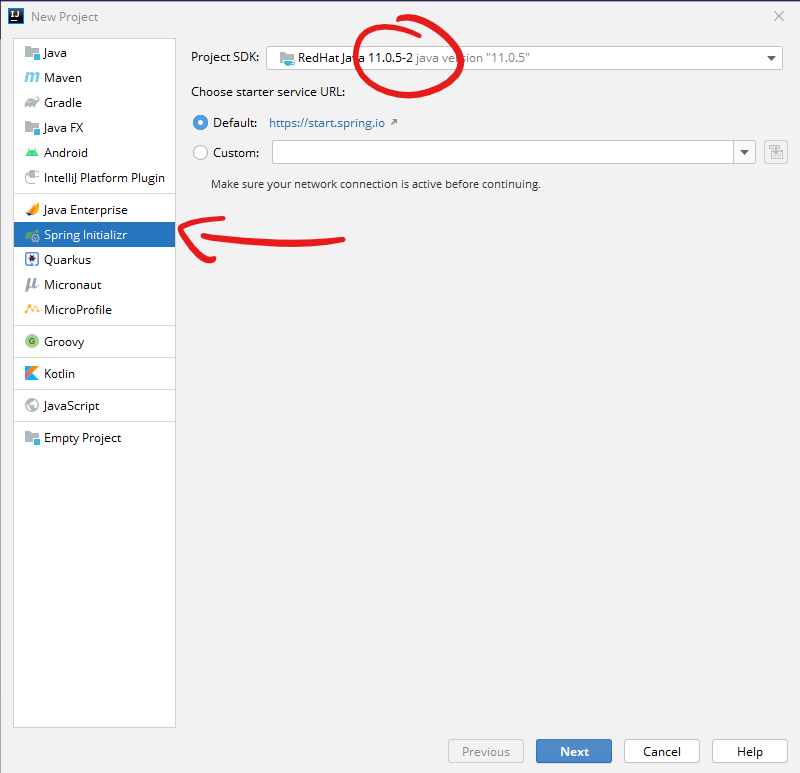

summary: Getting Started with Spring Boot
id: starting-Spring-Boot
categories: Sample
tags: medium
status: Published
authors: Carl Jones
Feedback Link:

# Getting Started with Spring Boot
<!-- ------------------------ -->
## Overview
Duration: 2

### What You'll Learn
- Using IntelliJ to create a Spring Boot project
- Adding dependencies to the Spring Boot project
- Choosing the right options for the Java SDK, build tool and names
- What the Spring Initializr provides
- Where to find the key features in Spring Boot
- How to run a Spring Boot application

<!-- ------------------------ -->
## Pick the right wizard

Open IntelliJ and create a new project either from the opening dialog or from File > New.



Select the Spring Initializr option.  Notice how it offers you the choice of https://start.spring.io or Custom.

Try going to that website in a browser.  It is the same tool in web form.

Pick a Java SDK.  Choose the version of 11 installed on your machine.

Then click "Next".

<!-- ------------------------ -->

## Choose the project settings

In this step, you will set the artifact group and id, and select a number of other options.

### Group and artifact

This is the identifier for the artifact produced by the project.  If you wanted to publish the
packaged jar file to a repository for others to use (say the Maven repository), the group and artifact id
form the name of that artifact.  This will make more sense when you see the Gradle file that is produced.

### Build type

You choose to use Maven or Gradle as the build tool.  We will use Gradle in our examples as the
build file is more readable.  It is worth learning the basics of Maven as many examples will use it.

### Language

Spring Boot supports multiple JVM-based languages.  We will stick with Java.

### Packaging

Traditionally, Java enterprise applications have been packaged as WAR files and
then deployed into an application server (such as Apache Tomcat).  Spring Boot
and other modern frameworks turn that inside out and embed the server within an
executable JAR file.  

We will use JAR packaging as standard.

### Java version

We've already selected a Java SDK version 11 so pick version 11.


Click "Next".

## Add dependencies

First of all, choose the last fully released version of Spring Boot.  Do not
pick milestone (M*) or Snapshot versions.  At time of writing, the last
production version is 2.3.4.


We want our first project to be:
- A web project
- A productive experience

### Web dependencies

To make this project into a web project, we will add two dependencies:
- Web > Spring Web (this adds Spring MVC capabilities and the Tomcat server)
- Template Engines > Thymeleaf (this add the Thymealeaf server-side templating engine)

With these dependencies, Spring Boot can listen for web requests, route then to a special
type of component known as a controller and return data to a view.  Thymeleaf supports templating
and will inject the data into the template.

### Productive

To make the project development cycle more productive, we will add:

- Developer Tools > Lombok
- Developer Tools > Spring Boot DevTools

We know what Lombok does.  Spring Boot DevTools allows us to avoid server restarts and supports LiveReload
of web pages. We'll see this in action later.


## Project name and file location

On the final step, Spring Boot will use the project name from earlier to
default the values.  It is strongly suggested that you DON'T put the
code into a OneDrive folder.  Consider making a folder on your C: drive
called "Projects" (or similar).  This will keep the path names shorter.

Use Gitlab to backup your code.

Normally, you can leave these settings at their default values.


Click "Finish".

## Examine the generated source

Let's have a look at the source code that is generated from this process.
You can do this by looking at tag "step-1" in the project at
[Gitlab project](https://git.cardiff.ac.uk/ase-2020/cm6213/springbootexamples)

### The Java source

The tool will generate code in both the src/main and src/test folders.
The project structure follows a convention.  It is possible to change this but
it requires configuration.  Spring Boot follows a "convention over configuration"
approach.  Use the defaults where possible.

#### The main class


```java
package uk.ac.cf.cm6213.springbootexamples;

import org.springframework.boot.SpringApplication;
import org.springframework.boot.autoconfigure.SpringBootApplication;

@SpringBootApplication
public class SpringBootExamplesApplication {

  public static void main(String[] args) {
    SpringApplication.run(SpringBootExamplesApplication.class, args);
  }

}
```

In this code, we can see the first use of an annotation.


```java
@SpringBootApplication
public class SpringBootExamplesApplication {
```

This tells Spring Boot that this class is the entry point for the application.
Note, how the code invokes the class SpringApplication and passes the class of
our generated class.  This tells us that we are calling Spring with our own
code as a parameter, so that Spring can call it or introspect it.

#### The test class

A simple test class is also created.  This is an empty test, but is enough
to test that Spring Boot has loaded correctly as it would fail if the
application hasn't started.

### The Gradle source

The tool creates an initial build.gradle file.

Examine the file and notice:

- the dependencies section.  Look back at what we added in the tool earlier.
- the source compatibility
- the Spring Boot version

Notice also that the tool generates a .gitignore file and the Gradle wrapper
files (gradlew, etc).  These files are put into source control.  This means that the
version of Gradle required to build the project is bundled with the project.

This means that a developer can build your code by checking out the project
and running
```
./gradlew build
```

## Review

In this codelab, we have used the Spring Initializr tool to create a first
Spring Boot project.  In a subsequent codelab, we will run the project using
Gradle and the command line.
